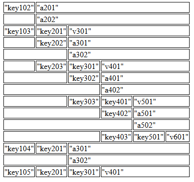

# obj2tbl.js
JavaScript Object -> HTML Table

## Run

```js
var tableElement = obj2tbl('tableID', object);
```

## Data

```js
var data  = {
    "key101":"v201",
    "key102":["a201","a202"],
    "key103":{
        "key201":"v301",
        "key202":["a301","a302"],
        "key203":{
            "key301":"v401",
            "key302":["a401","a402"],
            "key303":{
                "key401":"v501",
                "key402":["a501","a502"],
                "key403":{
                    "key501":"v601"
                }
            }
        }
    },
    "key104":{
        "key201":["a301","a302"]
    },
    "key105":{
        "key201":{
            "key301":"v401"
        }
    }
};
```

## Result

```html
<table id="samp">                                                                                             
<tr><td>"key102"</td><td colspan="5">"a201"</td></tr>                                                         
<tr><td colspan="1"></td><td colspan="5">"a202"</td></tr>                                                     
<tr><td>"key103"</td><td>"key201"</td><td colspan="4">"v301"</td></tr>                                        
<tr><td colspan="1"></td><td>"key202"</td><td colspan="4">"a301"</td></tr>                                    
<tr><td colspan="2"></td><td colspan="4">"a302"</td></tr>                                                     
<tr><td colspan="1"></td><td>"key203"</td><td>"key301"</td><td colspan="3">"v401"</td></tr>                   
<tr><td colspan="2"></td><td>"key302"</td><td colspan="3">"a401"</td></tr>                                    
<tr><td colspan="3"></td><td colspan="3">"a402"</td></tr>                                                     
<tr><td colspan="2"></td><td>"key303"</td><td>"key401"</td><td colspan="2">"v501"</td></tr>                   
<tr><td colspan="3"></td><td>"key402"</td><td colspan="2">"a501"</td></tr>                                    
<tr><td colspan="4"></td><td colspan="2">"a502"</td></tr>                                                     
<tr><td colspan="3"></td><td>"key403"</td><td>"key501"</td><td colspan="1">"v601"</td></tr>                   
<tr><td>"key104"</td><td>"key201"</td><td colspan="4">"a301"</td></tr>                                        
<tr><td colspan="2"></td><td colspan="4">"a302"</td></tr>                                                     
<tr><td>"key105"</td><td>"key201"</td><td>"key301"</td><td colspan="3">"v401"</td></tr>                       
</table>
```

